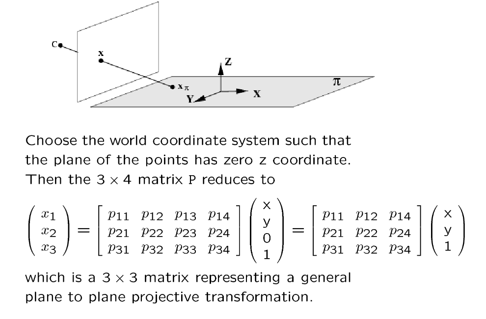
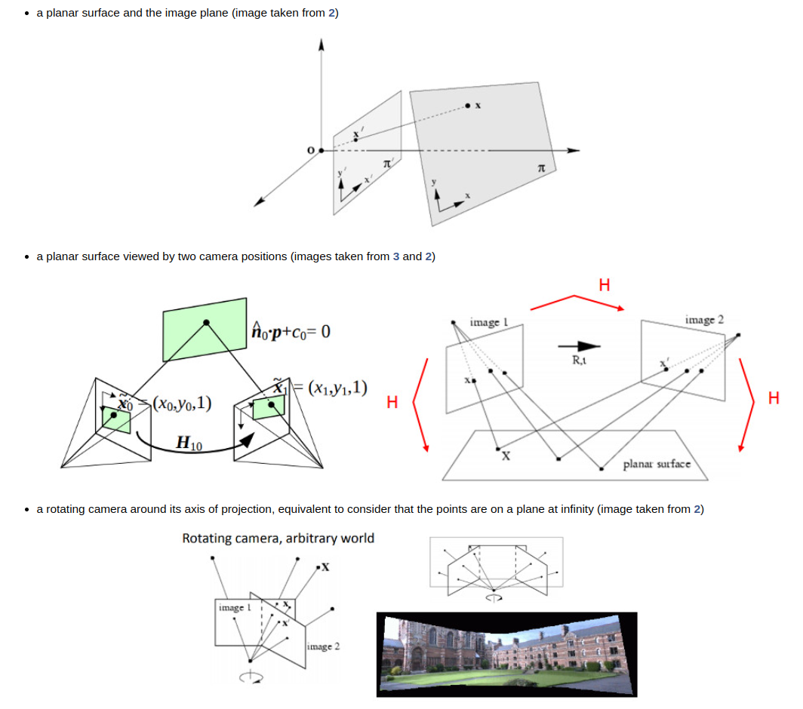

# Homography

> see: OpenCV tutorial at https://docs.opencv.org/4.x/d9/dab/tutorial_homography.html  
> see: Multiple View Geometry Tutorials at https://www.robots.ox.ac.uk/~az/tutorials/  
> see: Wiki https://en.wikipedia.org/wiki/Homography_(computer_vision)  

> April 9, 2024, my study note for homography

## Plane Projective Transformations
- See [CVPR 2003 Tutorial](good-tutorials/mvs-cvpr03_part1.pdf) by Marc Pollefeys and Andrew Zisserman
    - Choose the world coordinate system such that the plane of the points has zero $z$ coordinate.
    - Then the `3x4` matrix $P$ reduces to a `3x3` matrix, see below:

  

  

- Also, see a similar expression from OpenCV tutorial:

$$
\begin{align*}
\mathbf{X} &= \left( X, Y, 0, 1 \right ) \\
\mathbf{x} &= \mathbf{P}\mathbf{X} \\
&= \mathbf{K} \left[ \mathbf{r_1} \hspace{0.5em} \mathbf{r_2} \hspace{0.5em} \mathbf{r_3} \hspace{0.5em} \mathbf{t} \right ]
\begin{pmatrix}
X \\
Y \\
0 \\
1
\end{pmatrix} \\
&= \mathbf{K} \left[ \mathbf{r_1} \hspace{0.5em} \mathbf{r_2} \hspace{0.5em} \mathbf{t} \right ]
\begin{pmatrix}
X \\
Y \\
1
\end{pmatrix} \\
&= \mathbf{H}
\begin{pmatrix}
X \\
Y \\
1
\end{pmatrix}
\end{align*}
$$

## What is the homography matrix?

> See OpenCV Tutorial at https://docs.opencv.org/4.x/d9/dab/tutorial_homography.html

Briefly, the planar homography relates the transformation between two planes (up to a scale factor):

$$
\begin{bmatrix}
x^{'} \\
y^{'} \\
1
\end{bmatrix} = \mathbf{H}
\begin{bmatrix}
x \\
y \\
1
\end{bmatrix} =
\begin{bmatrix}
h_{11} & h_{12} & h_{13} \\
h_{21} & h_{22} & h_{23} \\
h_{31} & h_{32} & h_{33}
\end{bmatrix}
\begin{bmatrix}
x \\
y \\
1
\end{bmatrix}
$$

The homography matrix is a  `3x3`  matrix but with 8 DoF (degrees of freedom) as it is estimated up to a scale. It is generally normalized with  $ℎ_{33}=1$  or  $h_{11}^2 + h_{12}^2 + h_{13}^2 + h_{21}^2 + h_{22}^2 + h_{23}^2 + h_{31}^2 + h_{32}^2 + h_{33}^2 = 1$.

The following examples show different kinds of transformation but all relate to a transformation between two planes.

  

## Homogeneous Transformations

- Rotations and translations: rigid motions. A rigid motion couples pure translation with pure rotation:

  

- We can get the homogeneous transformation as
  $${ }^A P={ }_B^A R \,\, { }^BP + { }^A P_{BORG} $$

Or in the matrix expression as 

$$
\left(\begin{array}{l}
{ }^A P \\
1 
\end{array}\right)=\left(\begin{array}{l}
 { }_B^AR & { }^A P_{BORG} \\
0 & 1 
\end{array}\right) \left(\begin{array}{l}
{ }^B P \\
1 
\end{array}\right)
$$

## Homography between Two Cameras

> see Wiki: https://en.wikipedia.org/wiki/Homography_(computer_vision)

- In the field of computer vision, any two images of the same planar surface in space are related by a `homography` (assuming a pinhole camera model). This has many practical applications, such as `image rectification`, `image registration`, or `camera motion— rotation and translation` between two images. Once camera resectioning has been done from an estimated homography matrix, this information may be used for navigation, or to insert models of 3D objects into an image or video, so that they are rendered with the correct perspective and appear to have been part of the original scene (see Augmented reality).

- Given the Homogeneous Transformations above:

All feature maps are warped into different frontoparallel planes of the reference camera to form $N$ feature volumes $\{\mathbf{V}_i\}^N_{i=1}$. 

The coordinate mapping from the warped feature map $\mathbf{V}_i(d)$ to $\mathbf{F}_i$ (of source frame $I_{i}$) at depth $d$ is determined by the planar transformation $\mathbf{p}^{\text{src}} \sim \mathbf{H}_{i}(d) \cdot \mathbf{p}^{\text{ref}}$, where `$\sim$' denotes the projective equality and $\mathbf{H}_{i}(d)$ the homography between the $i^\text{th}$ feature map and the reference feature map at depth $d$. 

Let $\mathbf{n}_\text{ref}$ be the principle axis of the reference camera, and $\mathbf{K}_i$ and  $\mathbf{R}_i$ the intrinsic matrix and rotation matrix of source frame $I_i$, $\mathbf{K}_i$ and  $\mathbf{R}_i$ for reference frame $I_\text{ref}$, the homography is expressed by a $3 \times 3$ matrix:

$$
    \mathbf{H}_{i}(d) = \mathbf{K}_{i} \cdot  \mathbf{R}_{i} \cdot \left(\mathbf{I} - \frac{\mathbf{c}_{i}^{\text{ref}}\cdot \mathbf{n}^{T}_\text{ref}}{d}\right) \cdot \mathbf{R}^{T}_\text{ref} \cdot \mathbf{K}^{-1}_\text{ref}
$$

where $\mathbf{c}_{i}^{\text{ref}}$ is the translation of source camera (for $I_i$) with respect to the reference camera (for $I_\text{ref}$), i.e., $\mathbf{c}_{i}^{\text{ref}} = {}^{\text{\{ref\}}}\mathbf{p}_{\text{src-ORG}}$, to indicate the origin of source camera $\{\text{src}\}$ w.r.t. the reference camera coordinate system $\{\text{ref}\}$.

As for $\mathbf{n}_\text{ref}$, it is the unit length normal of the sweeping plane and $d$ is the distance (i.e., depth) of the plane to the origin (namely the center of the reference camera). For a fronto-parallel sweep \cite{gallup2007real}, $\mathbf{n}_\text{ref} = [0, 0, 1]$.

Applying the homography to map the reference coordinates :

$$
\begin{split}
\mathbf{p}^{\text{src}} &\sim \mathbf{H}_{i}(d) \cdot \mathbf{p}^{\text{ref}} \\ 
&\Longleftrightarrow \\
 \lambda \cdot \begin{pmatrix} x'\\ y' \\ 1 \end{pmatrix}
&= \mathbf{H}_{i}(d) \cdot \begin{pmatrix} x \\ y \\ 1 \end{pmatrix}
\end{split}
$$