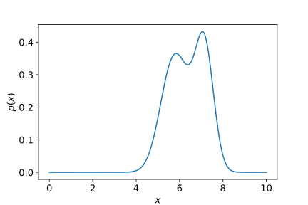
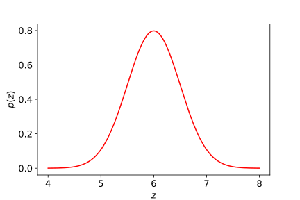
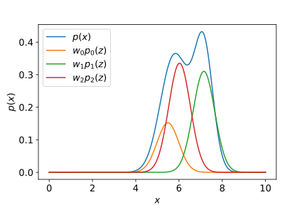
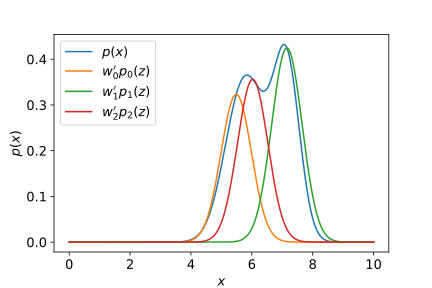
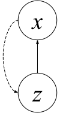
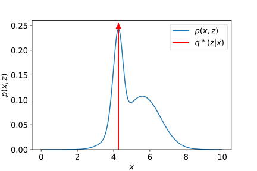
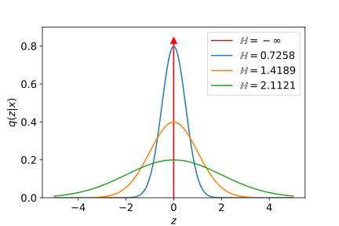
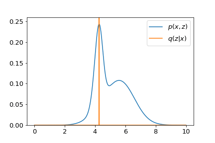
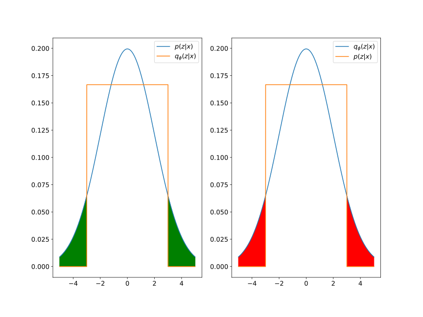

# ELBO — What & Why

> - see the original article at https://yunfanj.com/blog/2021/01/11/ELBO.html, writen by Jan 11, 2021  
> - updated and noted by Changjiang Cai on June 4, 2024.  

LBO (evidence lower bound) is a key concept in  [Variational Bayesian Methods](https://en.wikipedia.org/wiki/Variational_Bayesian_methods). It transforms inference problems, which are always  _intractable_, into optimization problems that can be solved with, for example, gradient-based methods.

## Introduction

In this post, I’ll introduce an important concept in  [Variational Bayesian (VB) Methods](https://en.wikipedia.org/wiki/Variational_Bayesian_methods)  — ELBO (evidence lower bound, also known as variational lower bound) — and its derivations, alongside some digging into it. ELBO enables the rewriting of statistical inference problems as optimization problems, the so-called  [_inference-optimization duality_](https://blog.evjang.com/2016/08/variational-bayes.html). Combined with optimization methods such as gradient descent and modern approximation techniques, e.g., deep neural networks, inference on complex distributions can be achieved. Numerous applications can be found in  [VAE](https://arxiv.org/abs/1312.6114v10),  [DVRL](https://arxiv.org/abs/1806.02426),  [MERLIN](https://arxiv.org/abs/1803.10760), to name a few.

## Table of Contents

-   [Motivation](#motivation)
-   [Amortized Variational Inference and Evidence Lower Bound](#amortized-variational-inference-and-elb)
-   [How Good is the Variational Posterior](#how-good-is-the-variational-posterior)
-   [Extension: ELBO for Temporal Sequence](#extension-elbo-for-temporal-sequence)
-   [Summaries](#summaries)

## Motivation

We are interested in finding the distribution  `p(x)`  of some given observations  `x`. Sometimes, this distribution can be fairly simple. For example, if the observations are the outcomes of flipping a coin,  `p(x)`  will be a  [Bernoulli distribution](https://en.wikipedia.org/wiki/Bernoulli_distribution). In a continuous case,  `p(x)`  will be a simple  [Gaussian distribution](https://en.wikipedia.org/wiki/Normal_distribution)  if you are measuring the heights of people. However, sadly, we generally encounter observations with complicated distributions. The  figure below, for instance, shows such a  `p(x)`, which is a  [mixed Gaussian distribution](https://en.wikipedia.org/wiki/Mixture_model#Gaussian_mixture_model).

Similar to  [the law of total probability](https://en.wikipedia.org/wiki/Law_of_total_probability)  which relates `marginal` probabilities to `conditional` probabilities, we can think that the distribution of interest  `p(x)`  can be **transformed** from a simple distribution, let’s say,  `p(z)`. We will assume that  p(z)  is  [a simple Gaussian distribution](https://yunfanj.com/blog/2021/01/11/ELBO.html#fig2). Any other types of distributions can play the same role.

Now we will try to use  `p(z)`  with some transformation  `f(⋅)`  to fit  `p(x)`. Concretely, we select several shifted copies of  `p(z)`  and multiply each of them with a weight  $w_i$. The result is shown in the figure below.

I have to say that this is not a bad fitting consider its simplicity. We can improve this fitting by tweaking the weights, which leads to the following fitting.

Let’s define this intuition formally. Given observations  `x`, we can build a  [latent variable model](https://en.wikipedia.org/wiki/Latent_variable_model)  with the variable  `z`  (we call it “_latent_” as it is not observed) such that the distribution of interest  `p(x)`  can be decomposed as 

$$
\begin{align*}
p\left(x\right) = \int_z p\left(x \vert z\right) p\left(z\right) dz.
\tag{1}
\end{align*}
$$

The intuition behind Eq. (1) is: We condition our observations on some variables that we don’t know. Therefore, the probability of observations will be the multiplication of the conditional probability and the prior probability of those unknown variables. Subsequently, we integrate out all cases of `unknowns` to get the distribution of interest. In the above naive case, the shifted means (corresponding to the non-zero means $\mu \neq $ 0 of the Normal distributions) and those weights we applied correspond to the term  $p\left(x \vert z\right)$, while the `transformation`, i.e., the summation, corresponds to the integration.

Despite the convenience provided by decomposing a very complicated distribution into the multiplication of a simple Gaussian conditional distribution and a Gaussian prior distribution, there is a `PROBLEM` — the integration. 

It is   _intractable_  because it is performed `over the whole latent space`, which is impractical when latent variables are continuous.

Besides the above-mentioned intractable integration, another question would be that how to obtain a function that transforms  `p(z)`  into  `p(x)`. In other words, how to get the conditional distribution $p\left(x \vert z\right)$. Despite that this function seems to be extremely non-linear, it is still not difficult to solve this problem as we know that neural networks are universal function approximators that can approximate any functions to arbitrary precisions. Therefore, we could use a neural network with parameters  $\theta$  to approximate the distribution  $p\left(x \vert z\right)$, which gives us  $p_\theta \left(x \vert z\right)$. In the subsequent sections, we will see how we can avoid the intractable integration and optimize our parameters.

## Amortized Variational Inference and ELB

Parameters  $\theta$  can be obtained from  [maximum likelihood estimation](https://en.wikipedia.org/wiki/Maximum_likelihood_estimation):  
$$\theta = \arg\max_\theta \log p_\theta \left(x\right)$$ 

To avoid integrating over the whole latent space, a natural question would be   “Can we infer any information about  $z$  after observing a sample  $x_i \in \mathcal{X}$” . The answer is “Yes” and we can use  $q_i\left(z\right)$  to approximate the distribution of  $z$  given the  i-th observation. 

This idea is the  [statistical inference](https://en.wikipedia.org/wiki/Statistical_inference), `which aims to infer the value of one random variable given the observed value of another random variable.` Nevertheless, there is an obvious **drawback** behind this intuition. The number of parameters of  $q_i\left(z\right)$  will scale up with the size of the set of observations because we build individual distribution after observing each data. To alleviate this problem, we introduce another network with parameters  $\phi$ to parameterize an approximation of  $q_i\left(z\right)$, i.e.,  

$$ q_\phi \left(z \vert x\right) \approx q_i \left(z\right) \quad \forall x_i \in \mathcal{X}$$

such that the increase of the number of parameters is  `amortized`. This is the  _amortized variational inference_ , which is also referred to as   _variational inference_  in recent literature. Up to this point, as shown below, we have explicitly built a probabilistic graphical model to represent our problem where the observation  $x$  is conditioned on the latent variable  $z$  and we aim to infer  $z$  after observing  $x$.

Now let’s revisit our objective to maximize the `log-likelihood` of observations  `x`  but with  $q_\phi \left(z \vert x\right)$  this time.

$$
\begin{align*}
\log p_\theta(x) &= \log \int_z p_\theta(x, z) dz \\
&= \log \int_z p_\theta(x, z) \frac{q_\phi(z \vert x)}{q_\phi(z \vert x)} dz \\
&= \log \mathbb{E}_{z \sim q_\phi(z \vert x)} \left[ \frac{p_\theta(x, z)}{q_\phi(z \vert x)}\right] \\
&\geq \mathbb{E}_z \left[ \log \frac{p_\theta(x,z)}{q_\phi(z \vert x)}\right] \text{by Jensen's inequality} \\
&= \mathbb{E}_z \left[ \log p_\theta(x,z) \right] + \int_z q_\phi(z \vert x) \log \frac{1}{q_\phi(z \vert x)} dz \\
&= \mathbb{E}_z \left[ \log p_\theta(x,z) \right] + \mathcal{H} \left(q_\phi \left(z \vert x\right) \right)
\tag{2}.
\end{align*}
$$

In the above equation, the term  $\mathcal{H}\left(\cdot\right)$  is the  [Shannon entropy](https://en.wikipedia.org/wiki/Entropy_(information_theory)). By definition, the term “_evidence_” is the value of a likelihood function evaluated with fixed parameters.

With the definition of $$\mathcal{L} = \mathbb{E}_z \left[ \log p_\theta(x,z) \right] + \mathcal{H} \left(q_\phi \left(z \vert x\right) \right),$$

it turns out that $\mathcal{L}$ sets a lower bound for the evidence of observations and maximizes  $\mathcal{L}$  will push up the log-likelihood of  $x$. Hence, we call  $\mathcal{L}$  the  **`evidence lower bound`**  (ELBO, sometimes referred to as  `variational lower bound`  as well).

Now let’s think about the rationale behind  $\mathcal{L}$. 
- First, we focus on the term  $\mathbb{E}_z \left[ \log p_\theta(x,z) \right]$  where  $z \sim q_\phi \left(z \vert x\right)$. Assuming that the neural network with parameters  $\theta$  gives us the joint distribution  $p_\theta \left(x, z\right)$, the optimal distribution  $q_\phi^\ast \left(z \vert x\right)$ that maximizes  $\mathcal{L}$ will be a  [Dirac delta](https://en.wikipedia.org/wiki/Dirac_delta_function)  which puts all the probability mass at the maximum of  $p_\theta \left(x, z\right)$. 
	- The interpretation is as follows. The operation of taking expectation is to just take a weighted average. 
	- In the case where data being averaged are fixed but weights can be varied (with the constraint that all weights sum to one), you just need to put 1 for the largest data point and 0 for others to maximize that average. 
	- With this intuition, we get the optimal distribution  $q_\phi^\ast \left(z \vert x\right)$ shown below.

- However, the story becomes different when we consider the second term in  $\mathcal{L}$, i.e., the `entropy` term. This term tells us the `uncertainty` of a distribution. Samples drawn from a distribution with higher entropy will become more uncertain. Sadly, the entropy of the optimal distribution  $q_\phi^\ast \left(z \vert x\right)$ we have just found is `negative infinity`. We can show this by constructing a random variable  `x`  drawn from a uniform distribution  $x \sim \mathcal{U} \left(x_0 - \epsilon, x_0 + \epsilon\right)$. Its entropy is  $\mathbb{E}_x \left[\log \frac{1}{p\left(x\right)}\right] = \log\left(2 \epsilon\right)$.  As  $\epsilon$  approaching zero, this distribution degenerates to a Dirac delta with entropy  $\lim_{\epsilon \to 0}\log\left(2\epsilon\right) = -\infty$. The figure below shows the entropy varies as a function of  $q_\phi \left(z \vert x\right)$.

Put all of them together, the maximization of  $\mathcal{L}$  tries to find an optimal distribution $q_\phi^\ast \left(z \vert x\right)$ which not only fits peaks of  $p_\theta \left(x, z\right)$.  but also spreads as wide as possible. A visualization is given in the demo below.

The neural network with parameters  $\phi$  is sometimes called the  **_inference network_**, with the distribution  $q_\phi\left(z \vert x\right)$  that it parameterizes named as the  **_variational posterior_**.

## How Good is the Variational Posterior

We care about the accuracy of the approximation performed by the inference network. As we mentioned earlier, the amortized variational inference leverages a distribution  $q_\phi \left(z \vert x\right)$  to approximate the true  _posterior_  of  $z$  given  $x$, i.e.,  $p\left(z \vert x\right)$. We choose  [Kullback–Leibler divergence](https://en.wikipedia.org/wiki/Kullback%E2%80%93Leibler_divergence)  as the metric to measure how close is  $q_\phi \left(z \vert x\right)$ to $p\left(z \vert x\right)$.

$$
\begin{align*}
D_{KL}\left(q_\phi(z \vert x) \Vert p(z \vert x)\right) &= \int_z q_\phi (z \vert x) \log \frac{q_\phi(z \vert x)}{p(z \vert x)} dz\\
&= -\int_z q_\phi(z \vert x) \log \frac{p(z \vert x)}{q_\phi(z \vert x)} dz\\
&= -\int_z q_\phi(z \vert x) \log \frac{p(z,x)}{q_\phi(z \vert x)p(x)} dz \\
&= - \left( \int_z q_\phi(z \vert x) \log \frac{p(z,x)}{q_\phi(z \vert x)} dz - \int_z q_\phi(z \vert x) \log p(x) dz\right) \\
&= - \int_z q_\phi(z \vert x) \log \frac{p(z,x)}{q_\phi(z \vert x)} dz + \log p(x).
\tag{3}
\end{align*}
$$

It is easy to show that the term  $\int_z q_\phi(z \vert x) \log \frac{p(z,x)}{q_\phi(z \vert x)} dz$  is equal to  $\mathcal{L}$, i.e., ELBO we defined previously. Rewriting Eq. (3) gives

$$
\begin{align*}
\log p \left(x\right) = \mathcal{L} + D_{KL}\left(q_\phi(z \vert x) \Vert p(z \vert x)\right).
\tag{4}
\end{align*}
$$

Although the true  _posterior_  $p \left(z \vert x\right)$  is unknown and hence we cannot calculate the KL divergence term analytically, an important property of `non-negativity` of KL divergence allows us to write Eq. (4) into an inequality:
$$ \begin{align*}
\log p\left(x\right) \geq \mathcal{L},
\tag{5}
\end{align*}
$$

which is consistent with Eq. (2) we derived before.

Another way to investigate ELBO is to rewrite it in the following way.

$$
\begin{align*}
\mathcal{L} &=  \int_z q_\phi(z \vert x) \log \frac{p_\theta \left(x, z\right)}{q_\phi(z \vert x)} dz \\
&= \int_z q_\phi(z \vert x) \log \frac{p_\theta \left(x \vert z\right)p\left(z\right)}{q_\phi(z \vert x)} dz \\
&= \mathbb{E}_{z \sim q_\phi \left(z \vert x\right)} \left[p_\theta\left(x \vert z\right)\right] - D_{KL} \left(q_\phi \left(z \vert x\right) \Vert p\left(z\right)\right)
\tag{6}
\end{align*}
$$

- It suggests that the `ELBO` is a trade-off between the reconstruction `accuracy` against the `complexity` of the variational  _posterior_. The KL divergence term can be interpreted as a measure of the additional information required to express the  _posterior_  relative to the  _prior_. As it approaches zero, the  _posterior_  is fully obtainable from the  _prior_. 
- Another intuition behind Eq. (6) is that we draw latent variables  $z$  from an approximated  _posterior_  distribution, which is very close to its  _prior_, and then use them to reconstruct our observations  $x$.  As the reconstruction gets better, our approximated  _posterior_  will become more accurate as well. 

From the perspective of auto-encoder, 
- the neural network with parameters  $\phi$  is called  _encoder_  because it maps from the observation space to the latent space, 
- while the network with parameters  $\theta$  is called  _decoder_  because it maps from the latent to the observation space. 

Readers who are interested in this convention are referred to  [Kingma  _et al._](https://arxiv.org/abs/1312.6114).

Additionally, let’s think about the reason behind the `KL divergence` we used to derive Eq. (3):

$$
\begin{align*}
D_{KL}\left(q_\phi(z \vert x) \Vert p(z \vert x)\right) = \int_z q_\phi (z \vert x) \log \frac{q_\phi(z \vert x)}{p(z \vert x)} dz.
\tag{7}
\end{align*}
$$

It suggests that the variational  _posterior_  $q_\phi(z \vert x)$  is prevented from spanning the whole space relative to the true  _posterior_  $p\left(z \vert x\right)$. Consider the case where the denominator in Eq. (7) is zero, the value of  $q_\phi(z \vert x)$ has to be zero as well otherwise the KL divergence goes to infinity. 

The figure below demonstrates this. Note that the green region in the left figure indicates where  $\frac{q_\phi(z \vert x)}{p(z \vert x)} = 0$, while the red region in the right figure indicates where  $\frac{q_\phi(z \vert x)}{p(z \vert x)} = \infty$. In summary, the  [reverse KL divergence](https://blog.evjang.com/2016/08/variational-bayes.html)  has the effect of zero-forcing as minimizing it leads to  $q_\phi(z \vert x)$  being squeezed under  $p\left(z \vert x\right)$.

## Extension: ELBO for Temporal Sequence

Consider the case that we wish to build a generative model  $p \left(\mathbf{x}_{0:t}, \mathbf{z}_{0:t} \right)$  for sequential data  $\mathbf{x}_{0:t} \equiv \left(x_0, x_1, \ldots, x_t \right)$  with a sequence of latent variable  $\mathbf{z}_{0:t} \equiv \left(z_0, z_1, \ldots, z_t \right)$, we can also derive a corresponding ELBO as a surrogate objective. Optimizing this objective leads to the maximization of the likelihood of the sequential observations.

$$
\begin{align*}
\log p \left(\mathbf{x}_{0:t} \right) &= \log \int_{\mathbf{z}_{0:t}} p \left(\mathbf{x}_{0:t}, \mathbf{z}_{0:t} \right) d\mathbf{z}_{0:t} \\
&= \log \int_{\mathbf{z}_{0:t}} p \left(\mathbf{x}_{0:t}, \mathbf{z}_{0:t} \right) \frac{q_\phi\left(\mathbf{z}_{0:t} \vert \mathbf{x}_{0:t}  \right)}{q_\phi\left(\mathbf{z}_{0:t} \vert \mathbf{x}_{0:t}  \right)}d\mathbf{z}_{0:t} \\
&= \log \mathbb{E}_{\mathbf{z}_{0:t} \sim q_\phi \left( \mathbf{z}_{0:t} \vert \mathbf{x}_{0:t}\right)} \left[ \frac{p \left(\mathbf{x}_{0:t}, \mathbf{z}_{0:t} \right) }{q_\phi \left( \mathbf{z}_{0:t} \vert \mathbf{x}_{0:t}\right)} \right] \\
&\geq \mathbb{E}_{\mathbf{z}_{0:t}} \left[\log \frac{p \left(\mathbf{x}_{0:t}, \mathbf{z}_{0:t} \right) }{q_\phi \left( \mathbf{z}_{0:t} \vert \mathbf{x}_{0:t}\right)}\right] \text{by Jensen's inequality}
\tag{8}
\end{align*}
$$

So far, this is similar to what we have derived for the stationary case, i.e., Eq. (2) in the previous [section](#amortized-variational-inference-and-elb). However, the following derivation will require some `factorizations` of the joint distribution and the variational posterior. Concretely, we factorize the temporal model  $p \left(\mathbf{x}_{0:t}, \mathbf{z}_{0:t} \right)$  and the approximation  $q_\theta \left( \mathbf{z}_{0:t} \vert \mathbf{x}_{0:t} \right)$ as

$$
p \left(\mathbf{x}_{0:t}, \mathbf{z}_{0:t} \right) = \prod_{\tau = 0}^t p \left(x_\tau \vert z_\tau\right) p \left(z_\tau \vert \mathbf{z}_{0:\tau -1}\right),
\tag{9}
$$

and

$$
q_\phi \left( \mathbf{z}_{0:t} \vert \mathbf{x}_{0:t} \right) = \prod_{\tau=0}^t q_\phi \left(z_{\tau} \vert \mathbf{z}_{0:\tau-1}, \mathbf{x}_{0:\tau}\right),
\tag{10}
$$

respectively.

To understand these `factorizations`, we can think that at each time step, the observation conditions on the latent variable at that time step, which also conditions on all latent variables before that time step. Expressing this relation recursively leads to Eq. (9). Similarly, the `approximated latent variable` at each time step conditions on the sequential observations up to that time and the history of latent variables, which is Eq. (10).

With these two factorizations, we can further derive Eq. (8) by plugging Eq. (9) and Eq. (10):

$$
\begin{align*}
&\mathbb{E}_{\mathbf{z}_{0:t}} \left[\log \frac{p \left(\mathbf{x}_{0:t}, \mathbf{z}_{0:t} \right) }{q_\phi \left( \mathbf{z}_{0:t} \vert \mathbf{x}_{0:t}\right)}\right] \\
&= \mathbb{E}_{\mathbf{z}_{0:t}} \left[\log \frac{\prod_{\tau = 0}^t p \left(x_\tau \vert z_\tau\right) p \left(z_\tau \vert \mathbf{z}_{0:\tau -1}\right)}{\prod_{\tau=0}^t q_\phi \left(z_{\tau} \vert \mathbf{z}_{0:\tau-1}, \mathbf{x}_{0:\tau}\right)}\right] \\
&= \mathbb{E}_{\mathbf{z}_{0:t}} \left[\sum_{\tau=0}^t \log p \left(x_\tau \vert z_\tau\right) + \log p \left(z_\tau \vert \mathbf{z}_{0:\tau -1}\right) - \log q_\phi \left(z_{\tau} \vert \mathbf{z}_{0:\tau-1}, \mathbf{x}_{0:\tau}\right)  \right] \\
&= \sum_{\tau=0}^t \mathbb{E}_{\mathbf{z}_{0:t}} \left[\log p \left(x_\tau \vert z_\tau\right) + \log p \left(z_\tau \vert \mathbf{z}_{0:\tau -1}\right) - \log q_\phi \left(z_{\tau} \vert \mathbf{z}_{0:\tau-1}, \mathbf{x}_{0:\tau}\right) \right].
\end{align*}
\tag{11}
$$

### Trick 1: $\mathbb{E}_{\mathbf{z}_{0:t}} [\cdot]$  $\rightarrow$  $\mathbb{E}_{\mathbf{z}_{0:\tau}} [\cdot]$

Now we will use `one trick` to replace variables. Note that as the variable  $\tau$  starts from 0 to  $t$, those items being taken expectation, i.e., 
$$\log p \left(x_\tau \vert z_\tau\right) + \log p \left(z_\tau \vert \mathbf{z}_{0:\tau -1}\right) - \log q_\phi \left(z_{\tau} \vert \mathbf{z}_{0:\tau-1}, \mathbf{x}_{0:\tau}\right)$$ 

will become invalid for  $\tau< \tau' \leq t$. Therefore, we can write the original expectation term  $\mathbb{E}_{\mathbf{z}_{0:t}} [\cdot]$  as  $\mathbb{E}_{\mathbf{z}_{0:\tau}} [\cdot]$. 

### Trick 2:  $\mathbb{E}_{\mathbf{z}_{0:\tau} \sim q_\phi \left(\mathbf{z}_{0:\tau} \vert \mathbf{x}_{0:\tau}\right)}[\cdot]$  $\rightarrow$   $\mathbb{E}_{z_\tau \sim q_\phi \left(z_\tau \vert \mathbf{z}_{0:\tau-1}, \mathbf{x}_{0:\tau}\right)} \mathbb{E}_{\mathbf{z}_{0:\tau-1} \sim q_\phi \left(\mathbf{z}_{0:\tau-1}\vert \mathbf{x}_{0:\tau-1}\right)}[\cdot]$

Furthermore, another trick will allow us to factorize the expectation. Given the expectation taken  _w.r.t._  $\mathbf{z}_{0:\tau} \sim q_\phi \left(\mathbf{z}_{0:\tau} \vert \mathbf{x}_{0:\tau}\right)$, i.e.,  

$$
\mathbb{E}_{\mathbf{z}_{0:\tau} \sim q_\phi \left(\mathbf{z}_{0:\tau} \vert \mathbf{x}_{0:\tau}\right)}[\cdot]
$$

we can factorize it as  

$$\mathbb{E}_{z_\tau \sim q_\phi \left(z_\tau \vert \mathbf{z}_{0:\tau-1}, \mathbf{x}_{0:\tau}\right)} \mathbb{E}_{\mathbf{z}_{0:\tau-1} \sim q_\phi \left(\mathbf{z}_{0:\tau-1}\vert \mathbf{x}_{0:\tau-1}\right)}[\cdot]$$

--- 
> Rough idea on how to prove trick it. 
> - Recall the product rule of probability: $p(X, Y ) = p(Y |X) p(X)$. Here $(X,Y)$ will be $(z_{0:\tau-1}, z_\tau)$
> - Then we can factorize the joint distribution $q_\phi(\mathbf{z}_{0:\tau} \mid \mathbf{x}_{0:\tau})$ as a product of conditional distributions:

$$
\begin{align*}
q_\phi(\mathbf{z}_{0:\tau} \mid \mathbf{x}_{0:\tau}) &= q_\phi(z_{0:\tau-1}, z_\tau \mid \mathbf{x}_{0:\tau}) \\
& =  q_\phi(z_\tau \mid \mathbf{z}_{0:\tau-1}, \mathbf{x}_{0:\tau}) \cdot q_\phi(\mathbf{z}_{0:\tau-1} \mid \mathbf{x}_{0:\tau})  \text{ note } \mathbf{x}_{\tau} \text{ is invalid for } \mathbf{z}_{\tau - 1} \\
&= q_\phi(z_\tau \mid \mathbf{z}_{0:\tau-1}, \mathbf{x}_{0:\tau}) \cdot q_\phi(\mathbf{z}_{0:\tau-1} \mid \mathbf{x}_{0:\tau-1})  
\end{align*}
\tag{11-B}
$$
> - Take the expectation of your function with respect to this distribution. 
> - Then, consider the distribution of the final element $z_\tau$ given the previous elements and the entire sequence $\mathbf{x}_{0:\tau}$: $q_\phi(z_\tau \mid \mathbf{z}_{0:\tau-1}, \mathbf{x}_{0:\tau})$. 
> - Take the expectation of the result from the first step with respect to this distribution.

---

With these tricks at hands, Eq. (11) can be written as

$$
\begin{align*}
& \sum_{\tau=0}^t \mathbb{E}_{\mathbf{z}_{0:t}} \left[\log p \left(x_\tau \vert z_\tau\right) + \log p \left(z_\tau \vert \mathbf{z}_{0:\tau -1}\right) - \log q_\phi \left(z_{\tau} \vert \mathbf{z}_{0:\tau-1}, \mathbf{x}_{0:\tau}\right) \right] \\
&= \sum_{\tau=0}^t \mathbb{E}_{z_\tau}\mathbb{E}_{\mathbf{z}_{0:\tau - 1}} \left[\log p \left(x_\tau \vert z_\tau\right) + \log p \left(z_\tau \vert \mathbf{z}_{0:\tau -1}\right) - \log q_\phi \left(z_{\tau} \vert \mathbf{z}_{0:\tau-1}, \mathbf{x}_{0:\tau}\right) \right] \\
&= \sum_{\tau=0}^t \mathbb{E}_{\mathbf{z}_{0:\tau - 1}}\mathbb{E}_{z_\tau} \left[\log p \left(x_\tau \vert z_\tau\right) + \log p \left(z_\tau \vert \mathbf{z}_{0:\tau -1}\right) - \log q_\phi \left(z_{\tau} \vert \mathbf{z}_{0:\tau-1}, \mathbf{x}_{0:\tau}\right) \right] \\
&= \sum_{\tau=0}^t \mathbb{E}_{\mathbf{z}_{0:\tau - 1}}\mathbb{E}_{z_\tau} \left[\log p \left(x_\tau \vert z_\tau\right) - \log \frac{q_\phi \left(z_{\tau} \vert \mathbf{z}_{0:\tau-1}, \mathbf{x}_{0:\tau}\right)}{p \left(z_\tau \vert \mathbf{z}_{0:\tau -1}\right)} \right] \\
&= \sum_{\tau=0}^t \mathbb{E}_{\mathbf{z}_{0:\tau - 1}}\left[\mathbb{E}_{z_\tau} \left[\log p \left(x_\tau \vert z_\tau\right)\right] - \mathbb{E}_{z_\tau}\left[\log \frac{q_\phi \left(z_{\tau} \vert \mathbf{z}_{0:\tau-1}, \mathbf{x}_{0:\tau}\right)}{p \left(z_\tau \vert \mathbf{z}_{0:\tau -1}\right)} \right]\right] \\
&= \sum_{\tau=0}^t \mathbb{E}_{\mathbf{z}_{0:\tau - 1}}\left[\mathbb{E}_{z_\tau} \left[\log p \left(x_\tau \vert z_\tau\right)\right] - D_{KL}\left(q_\phi \left(z_{\tau} \vert \mathbf{z}_{0:\tau-1}, \mathbf{x}_{0:\tau}\right)\Vert p\left(z_\tau \vert \mathbf{z}_{0:\tau -1}\right)  \right)\right].
\end{align*}
\tag{12}
$$

Put all of them together, we have derived a lower bound for the log-likelihood of temporal sequence. Great!

$$
\begin{align*}
&\log p \left(\mathbf{x}_{0:t} \right) \geq \\
&\sum_{\tau=0}^t \mathbb{E}_{\mathbf{z}_{0:\tau - 1}}\left[\mathbb{E}_{z_\tau} \left[\log p \left(x_\tau \vert z_\tau\right)\right] - D_{KL}\left(q_\phi \left(z_{\tau} \vert \mathbf{z}_{0:\tau-1}, \mathbf{x}_{0:\tau}\right)\Vert p\left(z_\tau \vert \mathbf{z}_{0:\tau -1}\right)  \right)\right]
\end{align*}
\tag{13}
$$

If we compare the derived ELBO for temporal sequence, i.e., Eq. (13), with the ELBO for the stationary observation, i.e., Eq. (6), we will find that ELBO for sequential observations is computed firstly by calculating the ELBO for a certain time step. Then this result is taken expectation  _w.r.t._  histories of latent variables considering the property of a sequence. Finally, results are summed up along time step. Don’t be scared by the math, it is fairly easy to understand if we start from the stationary case.

$$
\log p \left(\mathbf{x}_{0:t} \right) \geq \sum_{\tau=0}^t \mathbb{E}_{\mathbf{z}_{0:\tau - 1}}\left[  \underbrace{\mathbb{E}_{z_\tau} \left[\log p \left(x_\tau \vert z_\tau\right)\right] - D_{KL}\left(q_\phi \left(z_{\tau} \vert \mathbf{z}_{0:\tau-1}, \mathbf{x}_{0:\tau}\right)\Vert p\left(z_\tau \vert \mathbf{z}_{0:\tau -1}\right)  \right)}_{\text{Eq. (6)}} \right]
$$

## Summaries

In this post, we begin with the motivation to fit complicated distributions, then notice the intractable integration, subsequently introduce the amortized variational inference and derive the ELBO from several points of view, and finally, dig deeper facts behind the ELBO. An extension of derivation for temporal sequences is also provided. As I mentioned at the very beginning, it plays an important role because it provides a framework in which `statistical inference` can be transformed into `optimization`, leading to more and more amazing applications in the deep learning community.

Thanks for your interest and reading!