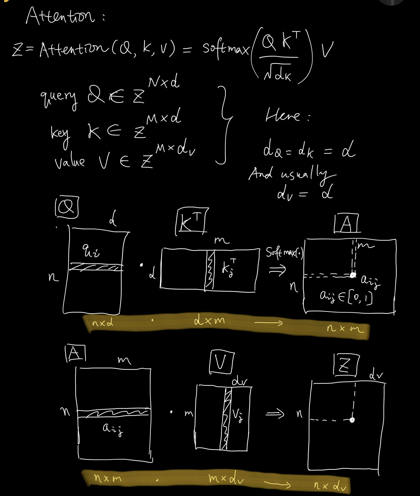
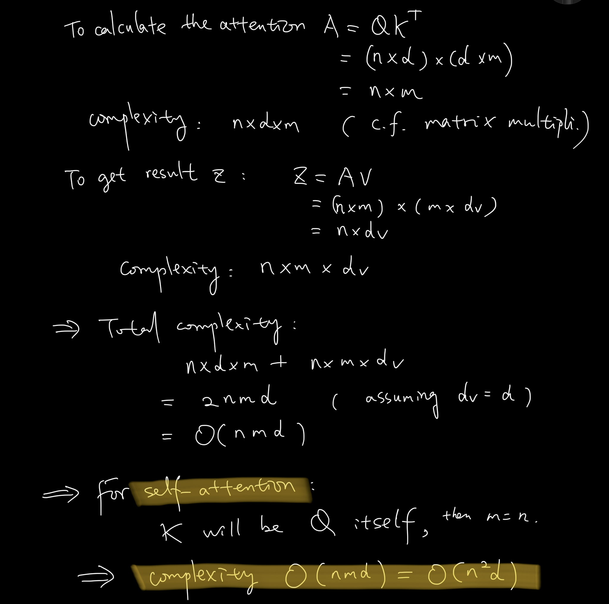
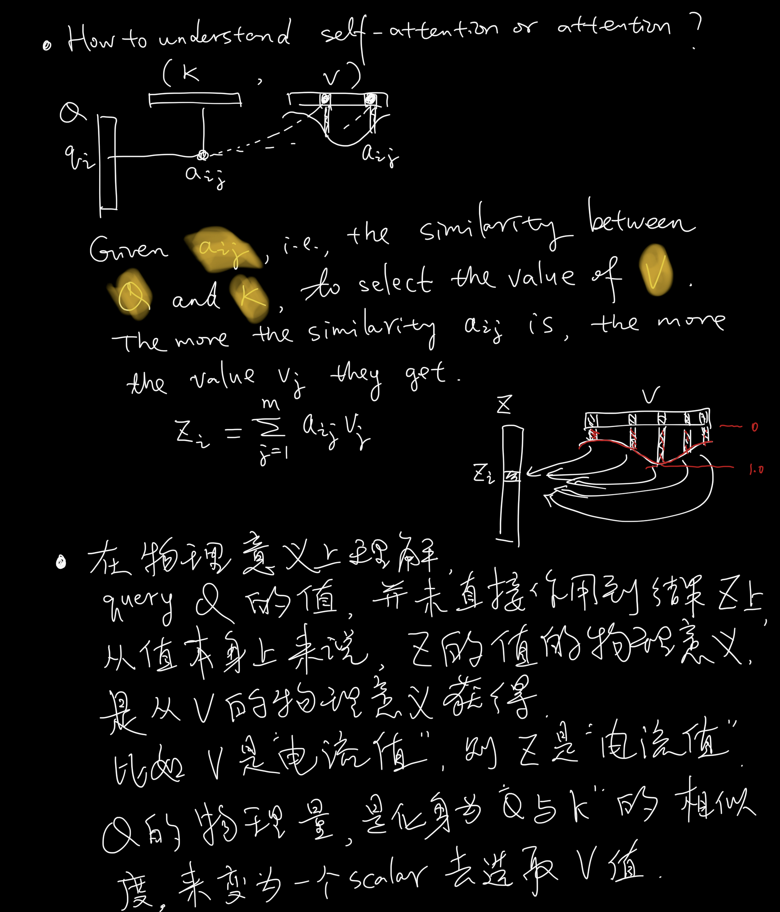
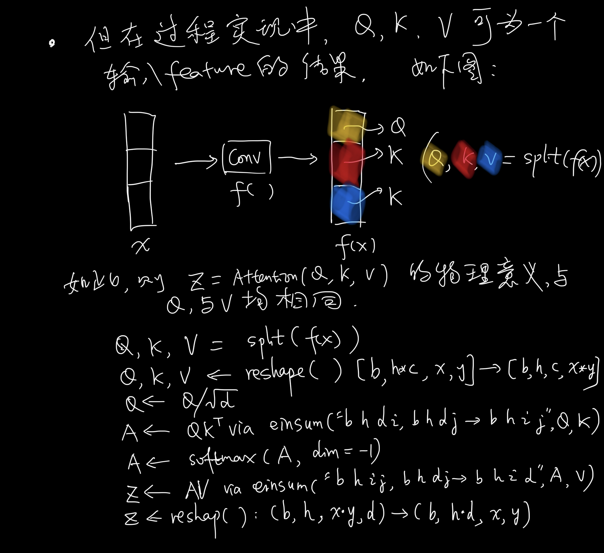
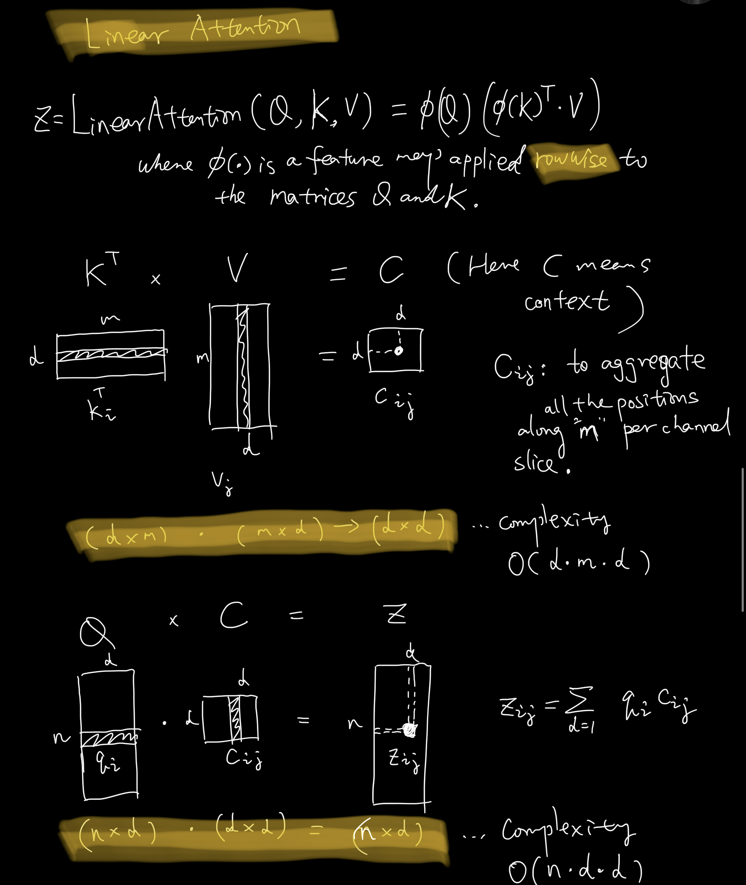
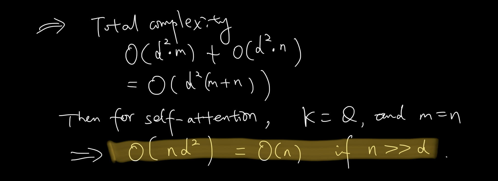
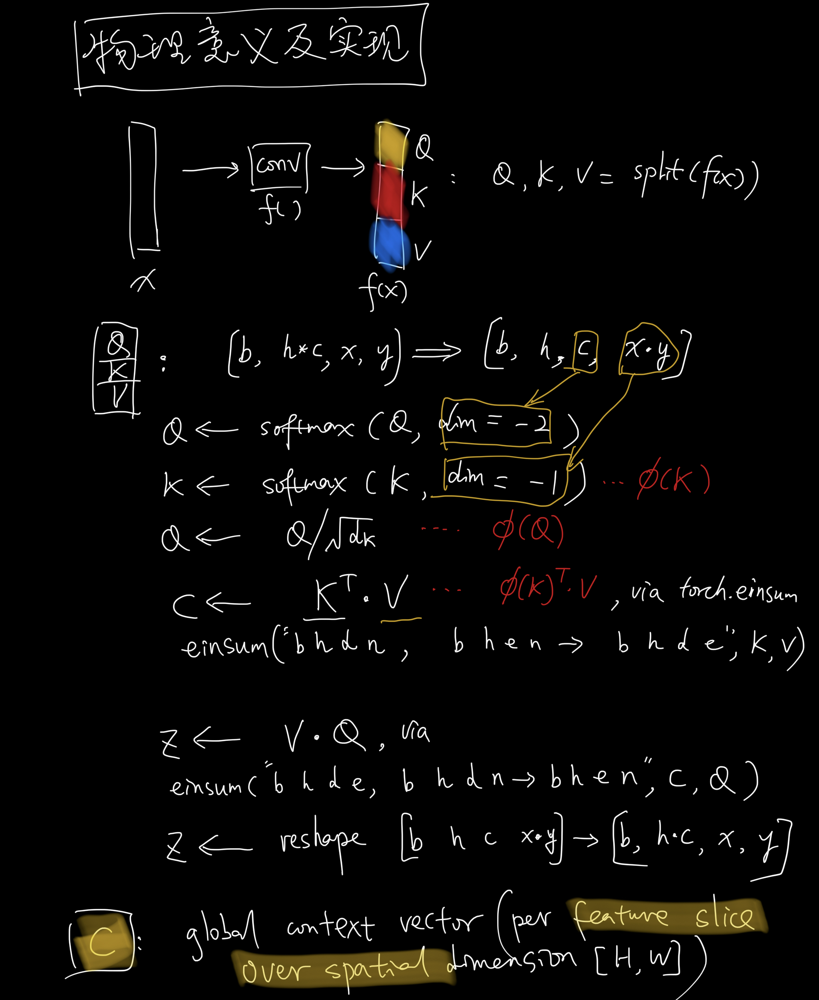

# Attention and Linear Attention

## Attention vs Linear Attention
Please see this figure which compares regular attention vs linear attention. This figure is copied from the paper [Efficient Attention: Attention with Linear Complexities](https://arxiv.org/pdf/1812.01243) or the github repo [Linear Attention Transformer](https://github.com/lucidrains/linear-attention-transformer).

<p align="center">
    
</p>
<p align="center"><b>Figure 1:</b> Illustration of the architecture of dot-product and efficient attention.</p>

## Attention

See this paper [Attention Is All You Need](https://arxiv.org/pdf/1706.03762). 

### Study Notes
See the following study notes about this regular attention.


- Definition

<p align="center">
    
</p>

- Complexity
<p align="center">
    
</p>
- Interpretation 

<p align="center">
    
</p>
- Implementation

<p align="center">
    
</p>


## Linear Attention

See the paper [Transformers are RNNs:
Fast Autoregressive Transformers with Linear Attention](https://arxiv.org/pdf/2006.16236) and the paper [Efficient Attention: Attention with Linear Complexities](https://arxiv.org/pdf/1812.01243). 

### Study Notes
See the following study notes about linear attention.

- Definition

<p align="center">
    
</p>

- Complexity
<p align="center">
    
</p>

- Implementation

<p align="center">
    
</p>

### How to understand the context $C$?

See 3.2 Efficient attention from [Efficient Attention: Attention with Linear Complexities](https://arxiv.org/pdf/1812.01243)

> Efficient attention uses each of these feature maps as a weighting over all positions and aggregates the value features through weighted summation to form a global context vector. The name reflects the fact that the vector does not correspond to a specific position, but is a **global** description of the input features.

## Code Implementation

- The code is copied from [simple_diffusion.py](https://github.com/lucidrains/denoising-diffusion-pytorch/blob/main/denoising_diffusion_pytorch/simple_diffusion.py) implemented by Phil Wang.

- See this repo [Linear Attention Transformer](https://github.com/lucidrains/linear-attention-transformer), 


```python
class Attention(nn.Module):
    def __init__(self, dim, heads=4, dim_head=32):
        super().__init__()
        self.scale = dim_head**-0.5
        self.heads = heads
        hidden_dim = dim_head * heads
        self.to_qkv = nn.Conv2d(dim, hidden_dim * 3, 1, bias=False)
        self.to_out = nn.Conv2d(hidden_dim, dim, 1)

    def forward(self, x):
        b, c, h, w = x.shape
        qkv = self.to_qkv(x).chunk(3, dim=1)
        q, k, v = map(
            lambda t: rearrange(t, "b (h c) x y -> b h c (x y)", h=self.heads), qkv
        )
        q = q * self.scale

        sim = einsum("b h d i, b h d j -> b h i j", q, k)
        sim = sim - sim.amax(dim=-1, keepdim=True).detach()
        attn = sim.softmax(dim=-1)

        out = einsum("b h i j, b h d j -> b h i d", attn, v)
        out = rearrange(out, "b h (x y) d -> b (h d) x y", x=h, y=w)
        return self.to_out(out)

class LinearAttention(nn.Module):
    def __init__(self, dim, heads=4, dim_head=32):
        super().__init__()
        self.scale = dim_head**-0.5
        self.heads = heads
        hidden_dim = dim_head * heads
        self.to_qkv = nn.Conv2d(dim, hidden_dim * 3, 1, bias=False)

        self.to_out = nn.Sequential(nn.Conv2d(hidden_dim, dim, 1), 
                                    nn.GroupNorm(1, dim))

    def forward(self, x):
        b, c, h, w = x.shape
        qkv = self.to_qkv(x).chunk(3, dim=1)
        q, k, v = map(
            lambda t: rearrange(t, "b (h c) x y -> b h c (x y)", h=self.heads), qkv
        )

        q = q.softmax(dim=-2)
        k = k.softmax(dim=-1)

        q = q * self.scale
        context = torch.einsum("b h d n, b h e n -> b h d e", k, v)

        out = torch.einsum("b h d e, b h d n -> b h e n", context, q)
        out = rearrange(out, "b h c (x y) -> b (h c) x y", h=self.heads, x=h, y=w)
        return self.to_out(out)
```