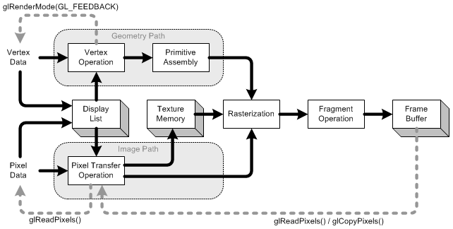

# OpenGL Rendering Pipeline

> see: https://www.songho.ca/opengl/gl_pipeline.html

OpenGL Pipeline has a series of processing stages in order. Two graphical information, vertex-based data and pixel-based data, are processed through the pipeline, combined together then written into the frame buffer. Notice that OpenGL can send the processed data back to your application.  _(See the grey color lines)_

## Display List

Display list is a group of OpenGL commands that have been stored (compiled) for later execution. All data, geometry (vertex) and pixel data, can be stored in a display list. It may improve performance since commands and data are cached in a display list. When OpenGL program runs on the network, you can reduce data transmission over the network by using display list. Since display lists are part of server state and reside on the server machine, the client machine needs to send commands and data only once to server's display list.  _(See more details in  [Display List](https://www.songho.ca/opengl/gl_displaylist.html).)_  

## Vertex Operation

Each vertex and normal coordinates are transformed by `GL_MODELVIEW` matrix (from object coordinates to eye coordinates). Also, if lighting is enabled, the lighting calculation per vertex is performed using the transformed vertex and normal data. This lighting calculation updates new color of the vertex.  _(See more details in  [Transformation](https://www.songho.ca/opengl/gl_transform.html))_  

## Primitive Assembly

After vertex operation, the primitives (`point`, `line`, and `polygon`) are transformed once again by projection matrix then clipped by viewing volume clipping planes; from eye coordinates to clip coordinates. After that, perspective division by `w` occurs and viewport transform is applied in order to map 3D scene to window space coordinates. Last thing to do in Primitive Assembly is culling test if culling is enabled.  

## Pixel Transfer Operation

After the pixels from client's memory are unpacked(read), the data are performed scaling, bias, mapping and clamping. These operations are called `Pixel Transfer Operation`. The transferred data are either stored in texture memory or rasterized directly to fragments.  

## Texture Memory

Texture images are loaded into texture memory to be applied onto geometric objects.  

## Raterization

`Rasterization` is the conversion of both geometric and pixel data into fragment. `Fragments` are a rectangular array containing color, depth, line width, point size and antialiasing calculations (`GL_POINT_SMOOTH`, `GL_LINE_SMOOTH`, `GL_POLYGON_SMOOTH`). If shading mode is `GL_FILL`, then the interior pixels (area) of polygon will be filled at this stage. Each fragment corresponds to a pixel in the frame buffer.  

## Fragment Operation

It is the last process to convert fragments to pixels onto frame buffer. The first process in this stage is texel generation; A texture element is generated from texture memory and it is applied to the each fragment. Then fog calculations are applied. After that, there are several fragment tests follow in order; Scissor Test ⇒ Alpha Test ⇒ Stencil Test ⇒ Depth Test.  
Finally, blending, dithering, logical operation and masking by bitmask are performed and actual pixel data are stored in `frame buffer`.  

## Feedback

OpenGL can return most of current states and information through  **glGet*()**  and  **glIsEnabled()**  commands. Further more, you can read a rectangular area of pixel data from frame buffer using  **glReadPixels()**, and get fully transformed vertex data using  **glRenderMode(GL_FEEDBACK)**.  **glCopyPixels()**  does not return pixel data to the specified system memory, but copy them back to the another frame buffer, for example, from front buffer to back buffer.