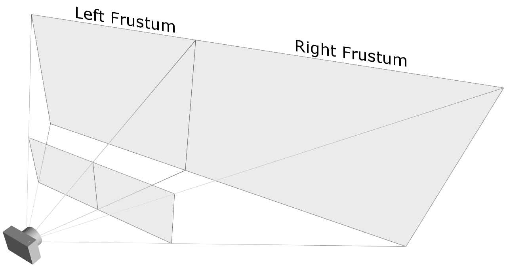
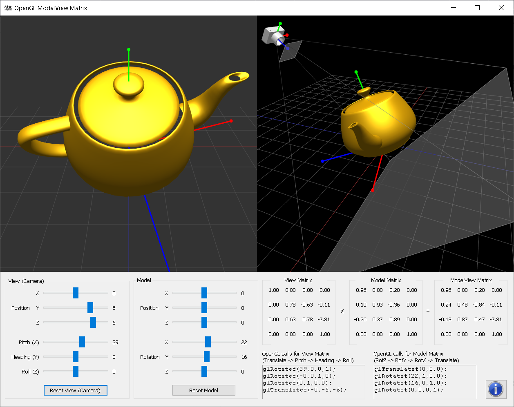

# 03 - OpenGL Transformation
@(3D Computer Vision)[OpenGL]

[TOC]


**Related Topics:**  [OpenGL Pipeline](https://www.songho.ca/opengl/gl_pipeline.html),  [OpenGL Projection Matrix](https://www.songho.ca/opengl/gl_projectionmatrix.html),  [OpenGL Matrix Class](https://www.songho.ca/opengl/gl_matrix.html)  

**Download:**  [matrixModelView.zip](https://www.songho.ca/opengl/files/matrixModelView.zip),  [matrixProjection.zip](https://www.songho.ca/opengl/files/matrixProjection.zip)

-   [Overview](#overview)
-   [OpenGL Transform Matrix](#opengl-transformation-matrix)
-   [Example: GL_MODELVIEW Matrix](#example1)
-   [Example: GL_PROJECTION Matrix](#example2)

## Overview

Geometric data such as vertex positions and normal vectors are transformed via  **Vertex Operation**  and  **Primitive Assembly**  operation in  [OpenGL pipeline](https://www.songho.ca/opengl/gl_pipeline.html)  before the rasterization process.

<center>

</center>

### Object Coordinates

It is the local coordinate system of objects and is the initial position and orientation of objects before any transform is applied. In order to transform objects, use `glRotatef()`, `glTranslatef()`, `glScalef()`.

### Eye Coordinates

It is yielded by multiplying `GL_MODELVIEW` matrix and object coordinates. Objects are transformed from object space to eye space using `GL_MODELVIEW` matrix in OpenGL.  **GL_MODELVIEW**  matrix is a combination of `Model` and `View` matrices $(M_{view} \cdot M_{model})$, where
 - `Model` transform $ M_{model} = T_{obj}^{world}$ is to convert from object space to world space. 
 -  And, `View` transform $M_{view} = T_{world}^{eye}$ is to convert from world space to eye space.

$$
\left(\begin{array}{c}
x_{\text {eye }} \\
y_{\text {eye }} \\
z_{\text {eye }} \\
w_{\text {eye }}
\end{array}\right)=M_{\text {modelView }} \cdot\left(\begin{array}{c}
x_{o b j} \\
y_{o b j} \\
z_{o b j} \\
w_{o b j}
\end{array}\right)=M_{\text {view }} \cdot M_{\text {model }} \cdot\left(\begin{array}{c}
x_{o b j} \\
y_{o b j} \\
z_{o b j} \\
w_{o b j}
\end{array}\right)
$$

Note that there is no separate camera (view) matrix in OpenGL. Therefore, in order to simulate transforming the camera view, the scene (3D objects and lights) must be transformed with the inverse of the view transformation. In other words, OpenGL defines that the camera is always located at (0, 0, 0) and facing to `-Z` axis in the eye space coordinates, and cannot be transformed.  _See more details of `GL_MODELVIEW` matrix in  [ModelView Matrix](https://www.songho.ca/opengl/gl_transform.html#modelview)_.

Normal vectors are also transformed from object coordinates to eye coordinates for lighting calculation. Note that normals are transformed in a different way as vertices do. It is mutiplying the tranpose of the inverse of `GL_MODELVIEW` matrix by a normal vector.  _See more details in  [Normal Vector Transformation](https://www.songho.ca/opengl/gl_normaltransform.html)_.  

$$
\left(\begin{array}{c}
n x_{\text {eye }} \\
n y_{\text {eye }} \\
n z_{\text {eye }} \\
n w_{\text {eye }}
\end{array}\right)=\left(M_{\text {modelView }}{ }^{-1}\right)^T \cdot\left(\begin{array}{c}
n x_{o b j} \\
n y_{o b j} \\
n z_{o b j} \\
n w_{o b j}
\end{array}\right)
$$


### Clip Coordinates

The eye coordinates are now multiplied with  **GL_PROJECTION**  matrix, and become the clip coordinates. This `GL_PROJECTION` matrix defines the viewing volume (frustum); how the vertex data are projected onto the screen (perspective or orthogonal). The reason it is called  _clip coordinates_  is that the transformed vertex `(x, y, z)` is clipped by comparing with `±w`.  _See more details of GL_PROJECTION matrix in  [Projection Matrix](https://www.songho.ca/opengl/gl_transform.html#projection)_.

$$
\left(\begin{array}{c}
x_{c l i p} \\
y_{c l i p} \\
z_{c l i p} \\
w_{c l i p}
\end{array}\right)=M_{\text {projection }} \cdot\left(\begin{array}{c}
x_{\text {eye }} \\
y_{\text {eye }} \\
z_{\text {eye }} \\
w_{\text {eye }}
\end{array}\right)
$$

### Normalized Device Coordinates (NDC)

It is yielded by dividing the clip coordinates by  [_w_](https://www.songho.ca/math/homogeneous/homogeneous.html). It is called  _perspective division_. It is more like window (screen) coordinates, but has not been translated and scaled to screen pixels yet. The range of values is now normalized from -1 to 1 in all 3 axes.

$$
\left(\begin{array}{l}
x_{n d c} \\
y_{n d c} \\
z_{n d c}
\end{array}\right)=\left(\begin{array}{l}
x_{c l i p} / w_{c l i p} \\
y_{c l i p} / w_{c l i p} \\
z_{c l i p} / w_{c l i p}
\end{array}\right)
$$


### Window Coordinates (Screen Coordinates)

It is yielded by applying normalized device coordinates (NDC) to viewport transformation. The NDC is scaled and translated in order to fit into the rendering screen. The window coordinates finally are passed to the rasterization process of  [OpenGL pipeline](https://www.songho.ca/opengl/gl_pipeline.html)  to become a fragment.  
- **glViewport()**  command is used to define the rectangle of the rendering area where the final image is mapped. And,
- **glDepthRange()**  is used to determine the  _z_  value of the window coordinates. The window coordinates are computed with the given parameters of the above 2 functions;  
**glViewport(x, y, w, h);**  
**glDepthRange(n, f);**

$$
\left(\begin{array}{c}
x_w \\
y_w \\
z_w
\end{array}\right)=\left(\begin{array}{c}
\frac{\mathbf{w}}{2} x_{n d c}+\left(\mathbf{x}+\frac{\mathbf{w}}{2}\right) \\
\frac{\mathbf{h}}{2} y_{n d c}+\left(\mathbf{y}+\frac{\mathbf{h}}{2}\right) \\
\frac{\mathbf{f}-\mathbf{n}}{2} z_{n d c}+\frac{(\mathbf{f}+\mathbf{n})}{2}
\end{array}\right)
$$


The viewport transform formula is simply acquired by the linear relationship between NDC and the window coordinates;  

$$
\left\{\begin{array}{rl}
-1 & \rightarrow \mathrm{x} \\
1 & \rightarrow \mathrm{x}+\mathrm{w}
\end{array},
\left\{\begin{array}{rl}
-1 & \rightarrow \mathrm{y} \\
1 & \rightarrow \mathrm{y}+\mathrm{h}
\end{array}, \left\{\begin{aligned}
-1 & \rightarrow \mathrm{n} \\
1 & \rightarrow \mathrm{f}
\end{aligned}\right.\right.\right.
$$

---

## OpenGL Transformation Matrix

OpenGL Transform Matrix:
$$
\left(\begin{array}{cccc}
m_0 & m_4 & m_8 & m_{12} \\
m_1 & m_5 & m_9 & m_{13} \\
m_2 & m_6 & m_{10} & m_{14} \\
m_3 & m_7 & m_{11} & m_{15}
\end{array}\right)
$$

OpenGL uses  $4 \times 4$ matrix for transformations. Notice that $16$ elements in the matrix are stored as 1D array in **column-major order**. You need to transpose this matrix if you want to convert it to the standard convention, **row-major format**.

OpenGL has 4 different types of matrices;  **GL_MODELVIEW**,  **GL_PROJECTION**,  **GL_TEXTURE**, and  **GL_COLOR**. You can switch the current type by using  **glMatrixMode()**  in your code. For example, in order to select `GL_MODELVIEW` matrix, use  **glMatrixMode(GL_MODELVIEW)**.


### Model-View Matrix (GL_MODELVIEW)

GL_MODELVIEW matrix combines the viewing matrix and modeling matrix into one matrix. In order to transform the view (camera), you need to move the whole scene with the inverse transformation.  **gluLookAt()**  is particularly used to set viewing transform.

<center>

</center>


The 3 matrix elements of the rightmost column ($m_{12}$,  $m_{13}$,  $m_{14}$) are for the translation transformation,  **glTranslatef()**. The element  $m_{15}$  is the  [homogeneous coordinate](https://www.songho.ca/math/homogeneous/homogeneous.html). It is specially used for projective transformation.

3 elements sets, ($m_{0}$,  $m_{1}$,  $m_{2}$), ($m_{4}$,  $m_{5}$,  $m_{6}$) and ($m_{8}$,  $m_{9}$,  $m_{10}$) are for Euclidean and affine transformation, such as rotation  **glRotatef()**  or scaling  **glScalef()**. Note that these 3 sets are actually representing 3 orthogonal axes;


-   ($m_{0}$,  $m_{1}$,  $m_{2}$): +X axis,  _left_  vector, (1, 0, 0) by default
-   ($m_{4}$,  $m_{5}$,  $m_{6}$) : +Y axis,  _up_  vector, (0, 1, 0) by default
-   ($m_{8}$,  $m_{9}$,  $m_{10}$) : +Z axis,  _forward_  vector, (0, 0, 1) by default

We can directly construct `GL_MODELVIEW` matrix from angles or lookat vector without using OpenGL transform functions. Here are some useful codes to build `GL_MODELVIEW` matrix:

-   [Angles to Axes](https://www.songho.ca/opengl/gl_anglestoaxes.html)
-   [Lookat to Axes](https://www.songho.ca/opengl/gl_lookattoaxes.html)
-   [Rotation About Arbitrary Axis](https://www.songho.ca/opengl/gl_rotate.html)
-   [Quaternion to Rotation Matrix](https://www.songho.ca/opengl/gl_quaternion.html)
-   [Matrix4 class](https://www.songho.ca/opengl/gl_matrix.html)

Note that OpenGL performs matrices multiplications in reverse order if multiple transforms are applied to a vertex. For example, if a vertex is transformed by  $M_A$  first, and transformed by  $M_B$  second, then OpenGL performs  $M_B  \times  M_A$  first before multiplying the vertex. So, the last transform comes first and the first transform occurs last in your code.  

$$
v^{\prime}=M_B \cdot\left(M_A \cdot v\right)=\left(M_B \cdot M_A\right) \cdot v
$$

~~// Note that the object will be translated first and then rotated~~

~~glRotatef(angle, 1, 0, 0);   // rotate object angle degree around X-axis~~

~~glTranslatef(x, y, z);       // move object to (x, y, z)~~

~~drawObject();~~


### Projection Matrix (GL_PROJECTION)

GL_PROJECTION matrix is used to define the frustum. This frustum determines which objects or portions of objects will be clipped out. Also, it determines how the 3D scene is projected onto the screen.  _(Please see more details  [how to construct the projection matrix](https://www.songho.ca/opengl/gl_projectionmatrix.html).)_

OpenGL provides 2 functions for GL_PROJECTION transformation.  
- **glFrustum()**  is to produce a perspective projection, and  
- **glOrtho()**  is to produce an orthographic (parallel) projection. 

Both functions require 6 parameters to specify 6 clipping planes;  _left_,  _right_,  _bottom_,  _top_,  _near_  and  _far_  planes. 8 vertices of the viewing frustum are shown in the following image.

<center>

</center>


The vertices of the far (back) plane can be simply calculated by the ratio of similar triangles, for example, the left of the far plane is:

$$
\frac{\text{far}}{\text{near}} = \frac{\text{left}_\text{far}}{\text{left}} \Rightarrow

\text{left}_\text{far} = \frac{\text{far}}{\text{near}} \cdot {\text{left}}
$$


For orthographic projection, this ratio will be 1, so the  _left_,  _right_,  _bottom_  and  _top_  values of the far plane will be the same as on the near plane.

<center>

</center>

You may also use `gluPerspective()` and `gluOrtho2D()` functions with less number of parameters.  **gluPerspective()**  requires only 4 parameters; vertical field of view (FOV), the aspect ratio of width to height and the distances to near and far clipping planes. The equivalent conversion from `gluPerspective()` to `glFrustum()` is described in the following code.

```cpp
// This creates a symmetric frustum.
// It converts to 6 params (l, r, b, t, n, f) for glFrustum()
// from given 4 params (fovy, aspect, near, far)
void makeFrustum(double fovY, double aspectRatio, double front, double back)
{
    const double DEG2RAD = 3.14159265 / 180;

    double tangent = tan(fovY/2 * DEG2RAD);   // tangent of half fovY
    double height = front * tangent;          // half height of near plane
    double width = height * aspectRatio;      // half width of near plane

    // params: left, right, bottom, top, near, far
    glFrustum(-width, width, -height, height, front, back);
}
```

<center>

</center>


However, you have to use `glFrustum()` directly if you need to create a non-symmetrical viewing volume. For example, if you want to render a wide scene into 2 adjoining screens, you can break down the frustum into 2 asymmetric frustums (left and right). Then, render the scene with each frustum.

### Texture Matrix (GL_TEXTURE)

Texture coordinates ($s,  t,  r,  q$) are multiplied by `GL_TEXTURE` matrix before any texture mapping. By default, it is the identity, so the texture will be mapped to objects exactly where you assigned the texture coordinates. By modifying `GL_TEXTURE`, you can slide, rotate, stretch, and shrink the texture.

```cpp
// rotate texture around X-axis
glMatrixMode(GL_TEXTURE);
glRotatef(angle, 1, 0, 0);
```

### Color Matrix (GL_COLOR)

The color components $(r,  g,  b,  a)$ are multiplied by `GL_COLOR` matrix. It can be used for color space conversion and color component swapping. GL_COLOR matrix is not commonly used and is required  **GL_ARB_imaging**  extension.

### Other Matrix Routines

**glPushMatrix()** : push the current matrix into the current matrix stack.

**glPopMatrix()** : pop the current matrix from the current matrix stack.

**glLoadIdentity()**: set the current matrix to the identity matrix.

**glLoadMatrix{fd}(_m_)**: replace the current matrix with the matrix  $m$.

**glLoadTransposeMatrix{fd}(_m_)** : replace the current matrix with the row-major ordered matrix  $m$.

**glMultMatrix{fd}(_m_)**: multiply the current matrix by the matrix  $m$, and update the result to the current matrix.

**glMultTransposeMatrix{fd}(_m_)**: multiply the current matrix by the row-major ordered matrix  $m$, and update the result to the current matrix.

**glGetFloatv(GL_MODELVIEW_MATRIX,  _m_)**: return 16 values of GL_MODELVIEW matrix to  $m$.

## Example: ModelView Matrix


<center>

</center>

This demo application shows how to manipulate GL_MODELVIEW matrix by translation and rotation transforms.


Note that all OpenGL function calls are implemented in  _ModelGL.h_  and  _ModelGL.cpp_  on both Mac and Windows versions, and these files are  _identical_  on both packages (platform independent).

This demo application uses  [a custom 4x4 matrix class](https://www.songho.ca/opengl/gl_matrix.html)  as well as default OpenGL matrix routines in order to specify model and camera transforms. There are 3 of matrix objects defined in ModelGL.cpp; matrixModel, matrixView and matrixModelView. Each matrix stores the pre-computed transformation and passes the matrix elements to OpenGL by using  **glLoadMatrixf()**. The actual drawing routine looks like;

```cpp
...
glPushMatrix();

// set view matrix for camera transform
glLoadMatrixf(matrixView.get());

// draw the grid at origin before model transform
drawGrid();

// set modelview matrix for both model and view transform
// It transforms from object space to eye space.
glLoadMatrixf(matrixModelView.get());

// draw a teapot after both view and model transforms
drawTeapot();

glPopMatrix();
...

```


The equivalent code using default OpenGL matrix functions is;

```cpp
...
glPushMatrix();

// initialze ModelView matrix
glLoadIdentity();

// First, transform the camera (viewing matrix) from world space to eye space
// Notice translation and heading values are negated,
// because we move the whole scene with the inverse of camera transform
// ORDER: translation -> roll -> heading -> pitch
glRotatef(cameraAngle[2], 0, 0, 1);  // roll
glRotatef(-cameraAngle[1], 0, 1, 0); // heading
glRotatef(cameraAngle[0], 1, 0, 0);  // pitch
glTranslatef(-cameraPosition[0], -cameraPosition[1], -cameraPosition[2]);

// draw the grid at origin before model transform
drawGrid();

// transform the object (model matrix)
// The result of GL_MODELVIEW matrix will be:
// ModelView_M = View_M * Model_M
// ORDER: rotZ -> rotY -> rotX -> translation
glTranslatef(modelPosition[0], modelPosition[1], modelPosition[2]);
glRotatef(modelAngle[0], 1, 0, 0);
glRotatef(modelAngle[1], 0, 1, 0);
glRotatef(modelAngle[2], 0, 0, 1);

// draw a teapot with model and view transform together
drawTeapot();

glPopMatrix();
...

```


## Example: Projection Matrix

<center>

</center>

This demo application is to show how to manipulate the projection transformation with 6 parameters; left, right, bottom, top, near and far values.

Again,  _ModelGL.h_  and  _ModelGL.cpp_  are exactly same files on both packages (platform independent), and all OpenGL function calls are placed in these files.

ModelGL class has  [a custom matrix object](https://www.songho.ca/opengl/gl_matrix.html),  _matrixProjection_, and 2 member functions,  _setFrustum()_  and  _setOrthoFrustum()_, which are equivalent to  _glFrustum()_  and  _glOrtho()_.

```cpp
///////////////////////////////////////////////////////////////////////////////
// return a perspective frustum with 6 params similar to glFrustum()
// (left, right, bottom, top, near, far)
///////////////////////////////////////////////////////////////////////////////
Matrix4 ModelGL::setFrustum(float l, float r, float b, float t, float n, float f)
{
    Matrix4 matrix;
    matrix[0]  =  2 * n / (r - l);
    matrix[5]  =  2 * n / (t - b);
    matrix[8]  =  (r + l) / (r - l);
    matrix[9]  =  (t + b) / (t - b);
    matrix[10] = -(f + n) / (f - n);
    matrix[11] = -1;
    matrix[14] = -(2 * f * n) / (f - n);
    matrix[15] =  0;
    return matrix;
}

///////////////////////////////////////////////////////////////////////////////
// return a symmetric perspective frustum with 4 params similar to
// gluPerspective() (vertical field of view, aspect ratio, near, far)
///////////////////////////////////////////////////////////////////////////////
Matrix4 ModelGL::setFrustum(float fovY, float aspectRatio, float front, float back)
{
    float tangent = tanf(fovY/2 * DEG2RAD);   // tangent of half fovY
    float height = front * tangent;           // half height of near plane
    float width = height * aspectRatio;       // half width of near plane

    // params: left, right, bottom, top, near, far
    return setFrustum(-width, width, -height, height, front, back);
}

///////////////////////////////////////////////////////////////////////////////
// set a orthographic frustum with 6 params similar to glOrtho()
// (left, right, bottom, top, near, far)
///////////////////////////////////////////////////////////////////////////////
Matrix4 ModelGL::setOrthoFrustum(float l, float r, float b, float t, float n, float f)
{
    Matrix4 matrix;
    matrix[0]  =  2 / (r - l);
    matrix[5]  =  2 / (t - b);
    matrix[10] = -2 / (f - n);
    matrix[12] = -(r + l) / (r - l);
    matrix[13] = -(t + b) / (t - b);
    matrix[14] = -(f + n) / (f - n);
    return matrix;
}
...

// how to pass projection matrx to OpenGL
Matrix4 projectionMatrix = setFrustum(l, r, b, t, n, f);
glMatrixMode(GL_PROJECTION);
glLoadMatrixf(matrixProjection.get());
...
```