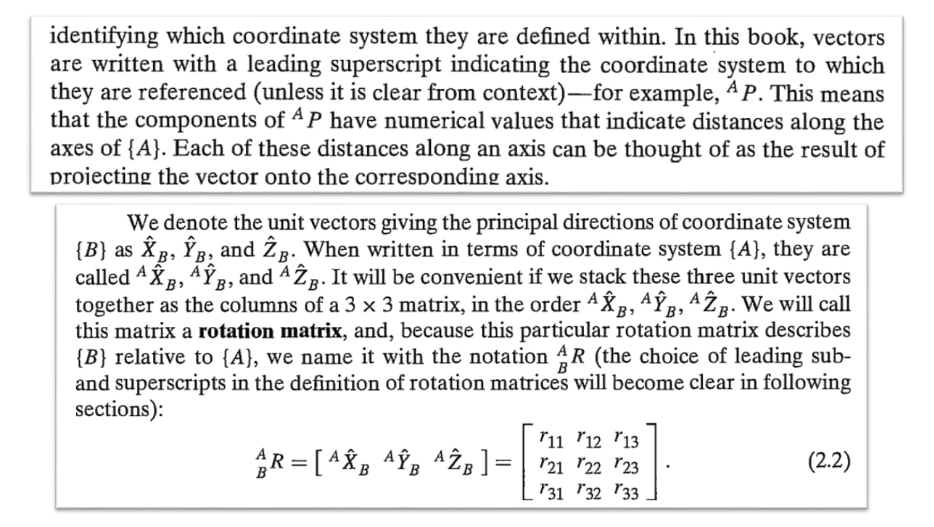
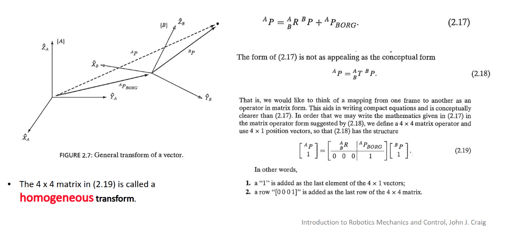
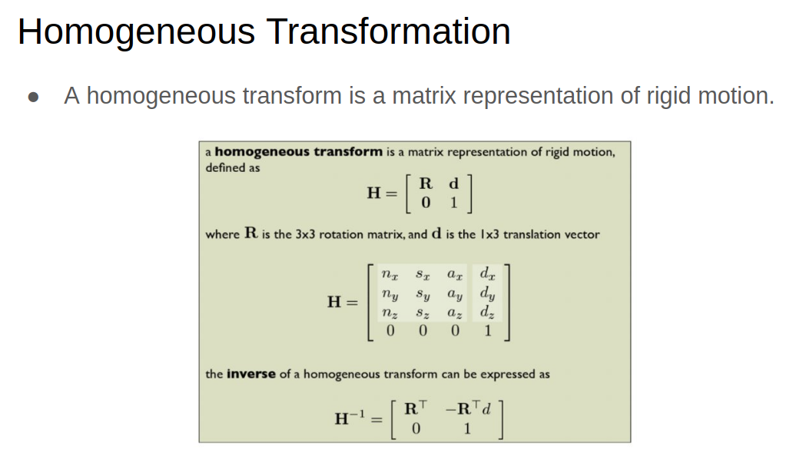

# Spatial descriptions and transformations

> see Introuction to Robotics Mechanics and Control, by Joh J. Craig, [pdf link](https://www.changjiangcai.com/files/text-books/Introduction-to-Robotics-3rd-edition.pdf)

## Spatial descriptions and transformations

- Notation

- homogenerous tranform

- homogenerous tranform matric representation

